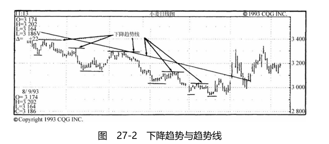

tags:: 技术分析

- > **只要有市场，便有趋势的存在。** [336](bookxnotepro://opennote/?nb={96a7184a-e3ca-4ba3-8db6-163c562e3c47}&book=ee1ea0d572bb075fb551591723e46383&page=335&x=293&y=172&id=7&uuid=23f1f273255a6e0f1e6910747703349d)
- ## 成交量
	- 成交量是对供需强度的一种度量，是价格运动的有力依据。
	- 一般来说，成交量越大，价格变动的意义也越大。
	- 趋势反转信号：
	  ((63637ee1-4b37-48ca-8a56-169fb09a240d))
	-
- ### 趋势线的变形
	- 趋势线斜率的变动（加速或减速）
	  ((63638551-cd93-47c7-9314-26248e4c6b9f))
	- 内部趋势线
	  ((636385ce-7ced-4444-a88d-caa6189f30cc))
	- 扇形
	  ((636385e7-5159-49a7-a4ac-258cf2ae2e92))
		- 已经形成的趋势线被突破，但价格运动方向未变，并且第二条趋势线很快形成。如此往复，直到运动方向改变。
		- [[Lamueno]] : 通常发生在过分快速的上涨或下跌后，市场对运动斜率进行修正
	-
- ###  道的三种趋势  [334](bookxnotepro://opennote/?nb={96a7184a-e3ca-4ba3-8db6-163c562e3c47}&book=ee1ea0d572bb075fb551591723e46383&page=333&x=300&y=749&id=4&uuid=44a4c8bc9205c99589e88849879c15a8)
	- 在分析市场的价格走势时，首先必须了解其中存在的三种趋势：
		- 1. 短期趋势，持续的期间为数天至数周（通常为14个交易日或以内）。交易者关心。
	- 2. 中期趋势，持续的期间为数周至数个月。投机者关心。
	- 3. 长期趋势，持续的期间为数个月至数年。投资者关心。
-
- ### 四种阶段 [335](bookxnotepro://opennote/?nb={96a7184a-e3ca-4ba3-8db6-163c562e3c47}&book=ee1ea0d572bb075fb551591723e46383&page=334&x=293&y=488&id=6&uuid=9a8e3af9b51135f330269262a1d99603)
- 在任何市场（股票、债券或商品）中，长期趋势会处于以下四种阶段中的一种：
- 1. 承接(accumulation)（投资者逐步买进）。
- 2. 出货(distribution)（投资者逐渐卖出）。
- 3. 向上或向下的趋势。
- 4. 整理(consolidation)（在一个经过确认的趋势发展过程中，由于获利回吐造成的调整）。
-
- ### 上升趋势  [336](bookxnotepro://opennote/?nb={96a7184a-e3ca-4ba3-8db6-163c562e3c47}&book=ee1ea0d572bb075fb551591723e46383&page=335&x=293&y=390&id=8&uuid=90a6ca790b637796b32cbd34d20164c2)
- 上升趋势是一种价格走势，它由一系列的上升波段构成，每一上升波段都向上穿越先前波段的高点，中间还夹杂着下降波段，但每一下降波段的低点都不会向下跌破先前下降波段的低点。换言之，上升趋势是由一系列高点与低点都不断垫高的波段构成的（见图27-1）。
- 
- ### 下降趋势
- 下降趋势是一种价格走势，它由一系列的下降波段构成，每一下降波段都向下穿越先前波段的低点，中间还夹杂着上升波段，但每一上升波段的高点都不会向上穿越先前上升波段的高点。换言之，下降趋势是由一系列高点与低点都不断走低的波段构成的（见图27-2）。 [336](bookxnotepro://opennote/?nb={96a7184a-e3ca-4ba3-8db6-163c562e3c47}&book=ee1ea0d572bb075fb551591723e46383&page=335&x=293&y=692&id=9&uuid=5adbc4a817e4b5325353ca6e0d43d426)
  id:: 63583330-eb4e-4f1c-b292-41743709bf32
- 
- ### 如何绘制趋势线  [337](bookxnotepro://opennote/?nb={96a7184a-e3ca-4ba3-8db6-163c562e3c47}&book=ee1ea0d572bb075fb551591723e46383&page=336&x=293&y=627&id=10&uuid=c4673b4d518ae15d3d4160b4b2b5f4e7)
	- ((63637fba-b6ec-4b3a-81dd-85c7255bf134))
	- 上升趋势线：连接价格波动的**低点**
	- 下降趋势线：连接价格波动的**高点**
	- 略与直觉相左，但这非常重要。
	- 1.选择考虑的时间：长期（数个月至数年）、中期（数个星期至数个月）或短期（数天至数个星期）。
	- 2.上升趋势线：在考虑的时间内，[:strong 以最低的低点为起点]，向右上方绘制一条直线，连接最高点前的某一个低点，使这条直线在两个低点之间未穿越任何价位。延伸这条直线而经过最高点（这是指水平轴上的位置而言）。趋势线经过所考虑的最高点以后，它可能穿越某些价位。事实上，这是趋势发生变化的一种现象，稍后将讨论这方面的问题（见图27-1）。
	- 3.下降趋势线：在考虑的时间内，以最高的高点为起点，向右下方绘制一条直线，连接最低点前的某一个高点，而使这条直线在两个高点之间未穿越任何价位。延伸这条直线而经过最低点（见图27-2）。
-
- ### 趋势变动的1-2-3准则 [338](bookxnotepro://opennote/?nb={96a7184a-e3ca-4ba3-8db6-163c562e3c47}&book=ee1ea0d572bb075fb551591723e46383&page=337&x=296&y=282&id=11&uuid=99f3aa4b17d5f5c62882cc8b552b1017)
- 当趋势变动时，必须具备以下三个条件：
- 1.趋势线必须被突破——价格必须穿越绘制的趋势线。
- 2.上升趋势不再创新高，或下降趋势不再创新低。例如，在上升趋势的回档走势之后，虽然价格回升，但未能突破先前的高点，或仅稍做突破而又回档。类似的情况也会发生在下降趋势中。这通常被称为试探(test)高点或低点。这种情况通常——但不是必然——发生在趋势变动的过程中。若非如此，则价格走势几乎总是受到重大消息的影响，而向上或向下跳空，并造成异于“常态”的激烈价格走势。
- 3.在下降趋势中，价格向上穿越先前的短期反弹高点；或在上升趋势中，价格向下穿越先前的短期回档低点。
-
- 当这三个条件同时成立时，相当于道氏理论对趋势变动的确认。
- 当前两个条件仅发生一个时，则代表趋势可能发生变动。当三个条件发生两个时，这就增加了趋势发生变动的可能性。当所有三个条件都发生时，就是趋势变动的定义。
- 
-